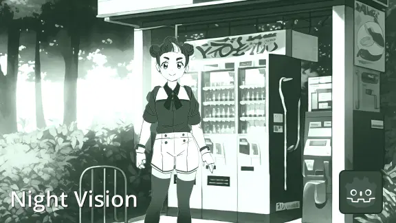

# Color Matrix v0.1

**Scroll down for previews**

*This is a work in progress so the project is messy.*

Apply and blend matrices to colorize a scenes or images.

No bulky complex shaders that struggle to blend together. Use easy handles to create matrices which make blending easy!

# Features
- 12 built in effects to start from & a tweakable blend amount.
- Duotone: Use two colors to blend between a grayscale image.
- Temperature: Make the image warm/red or cold/blue.
- Plus: Saturation, contrast, invert, hue shift...
- Live editor previews.
- Fast blending by using Godot's built in Projection class for matrix mult.
- Color blindness simulators.
- Automatic material setup for CanvasGroup.

# Saving blends

Play around with the `Initial > initial_matrix` to create a blend you like.

To save the final matrix scroll down to `Result > result_matrix` and click the arrow at the right to save to disk.

Modifying the `result_matrix` won't do anything. Just modify `initial_matrix`.

# Previews
| | | |
|-|-|-|
||||
||||
||||
||||
||||
||||
||||
||||
