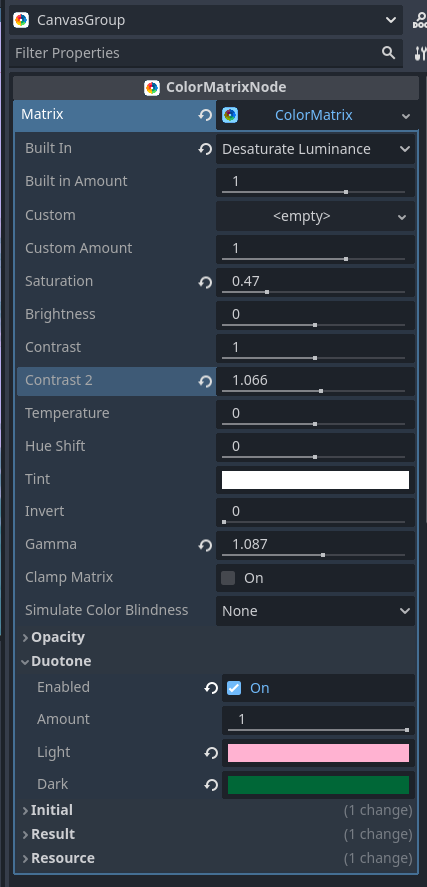
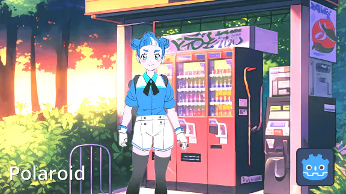
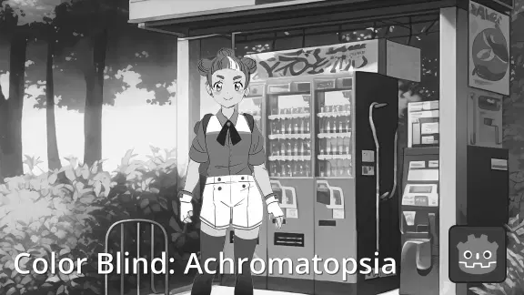

# Color Matrix v1.

**Scroll down for previews**

Apply and blend matrices to colorize a scenes or images.

No bulky complex shaders that struggle to blend together. Use easy handles to create matrices which make blending easy!

# Features
- 11 pre built effects to start from.
- Duotone: Use two colors to blend between a grayscale image.
- Multiple knobs for tweaking saturation, contrast, temperature, hue...
- Live editor previews.
- Fast blending by using Godot's built in Projection class for matrix mult.
- Color blindness simulators.
- Automatic material setup for CanvasGroup.

# Previews
| | | |
|-|-|-|
||||
||||
||||
||||
||||
||||
||||

